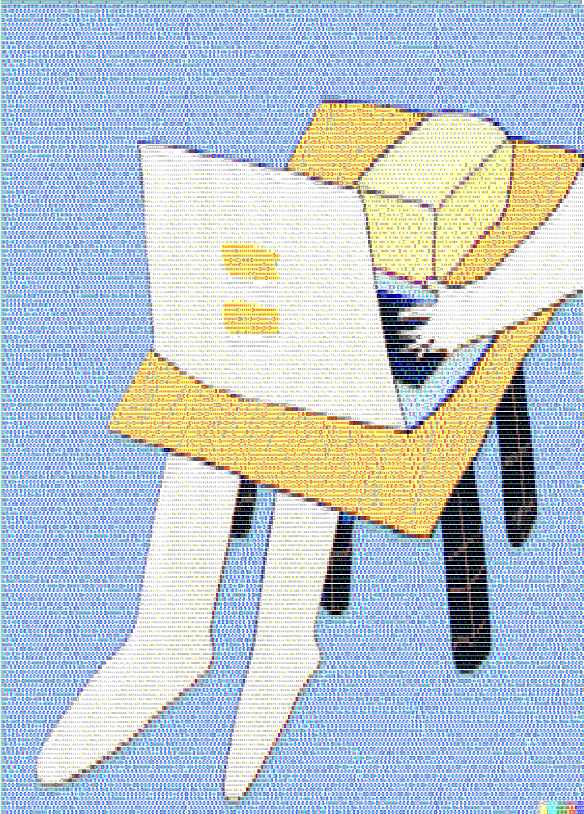

# README

## Development Log

## Prerequisites

- Ruby on Rails for application layer
- SQLite for the database

## Getting Started

bundle
spring rails s

1. How do you stand-up a publicly facing service?
2. What considerations are you making to scale the service?
3. How are you constructing tests?
4. How are new versions built and deployed?

## ASCII Art

I used Dall-E to generate an image with the prompt:

```
stick of butter with hands and legs typing on a computer in an empty room with a light blue background; graphic art
```

Then I fed that image into https://www.ascii-art-generator.org/ to generate a colored ASCII art version.


